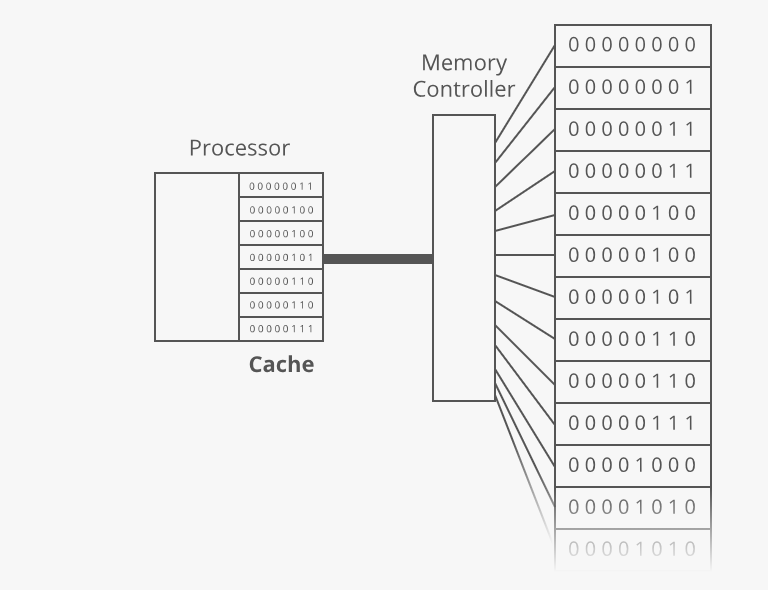
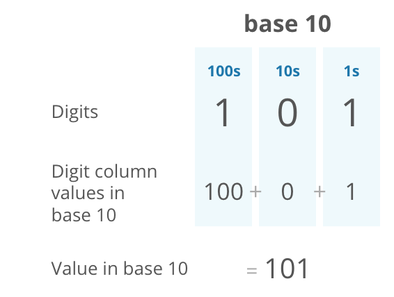
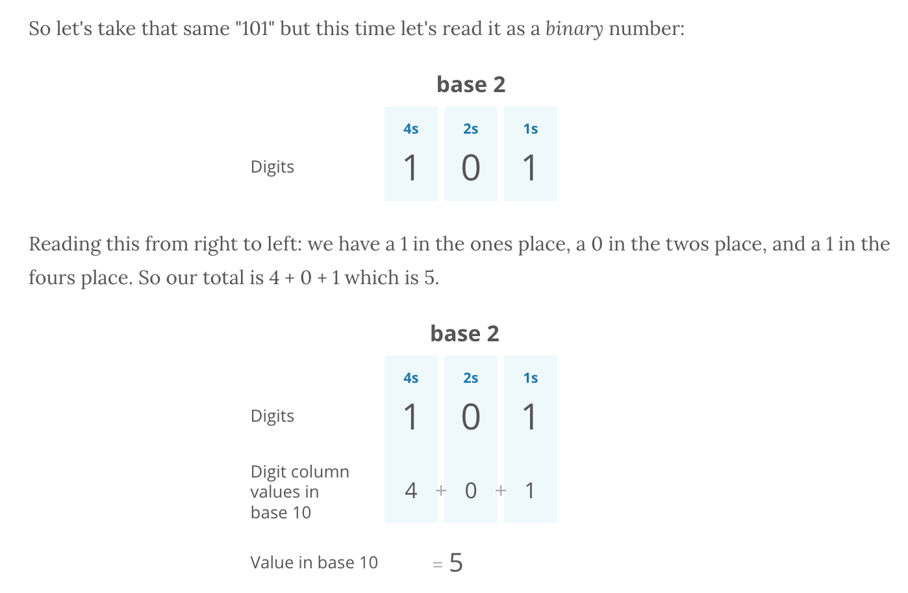

# algorithm-workbench

JS algo workbench repo w notes

# Big-O Notation

### Constant Time - O(1)

A single operation, regardless of input size

```javascript
function printFirstItem(items) {
  console.log(items[0]);
}
```

### Linear Time = O(n)

1 to 1 ratio of input : work

worst case runtime assumes O(n)

```javascript
function printAllItems(items) {
  items.forEach(item => {
    console.log(item);
  });
}

// worst case

function contains(haystack, needle) {
  // Does the haystack contain the needle?
  for (let i = 0; i < haystack.length; i++) {
    if (haystack[i] === needle) {
      return true;
    }
  }

  return false;
}
```

### Quadratic Time = O(n^2)

n to (n \* n( ratio of input : work

(even if there are slight variances to the 'double' factor)

```javascript
function printAllNumbersThenAllPairSums(numbers) {
  console.log("these are the numbers:");
  numbers.forEach(number => {
    console.log(number);
  });

  console.log("and these are their sums:");
  numbers.forEach(firstNumber => {
    numbers.forEach(secondNumber => {
      console.log(firstNumber + secondNumber);
    });
  });
}
```

### Space complexity: O(1)

fixed number of variables, regardless of input

```javascript
function sayHiNTimes(n) {
  for (let i = 0; i < n; i++) {
    console.log("hi");
  }
}
```

### Space complexity: O(n)

number of variables / storage depends on the size of input

```javascript
function arrayOfHiNTimes(n) {
  const hiArray = [];
  for (let i = 0; i < n; i++) {
    hiArray[i] = "hi";
  }
  return hiArray;
}
```

So.. O(1)O(1) space is much smaller than O(n)O(n) space. And O(1)O(1) time is much faster than O(n)O(n) time.

# CS Fun

### RAM - Random Access Memory

Processor -> Memory Controller -> RAM shelves

A cache stores recent and proximate bytes in a cache for greater speed:



When the processor asks for the contents of a given memory address, the memory controller also sends the contents of a handful of nearby memory addresses. And the processor puts all of it in the cache.

### Binary Numbers (8 bits = 1 byte)

#### Base10: _decimal_:



#### Base2: _binary_:



#### Base16: _hexi-decimal_:

### Fixed-width integers

Most integers are fixed-width or fixed-length, which means the number of bits they take up doesn't change.

_case in point_ : If we have a 64-bit fixed-length integer, it doesn't matter if that integer is 0 or 193,457—it still takes up the same amount of space in RAM: 64 bits.

#### How many different numbers can we express with 1 bit?

Answer: 2 (0 or 1)

#### How many different numbers can we express with 1 byte (8 bits)?

Answer: (2^8) = 256 different numbers

#### As such...

The 256 possibilities we get with 1 byte are pretty limiting. So we usually use 4 or 8 bytes (32 or 64 bits) for storing integers...

32-bit integers have 2^{32} = _4 billion_

64-bit integers have 2^{64} = _10 billion_

#### Memory vs BigO notation:

In big O notation, we say fixed-width integers take up constant space or O(1)O(1) space.

And because they have a constant number of bits, most simple operations on fixed-width integers (addition, subtraction, multiplication, division) take _constant time_ (O(1)O(1) time).
